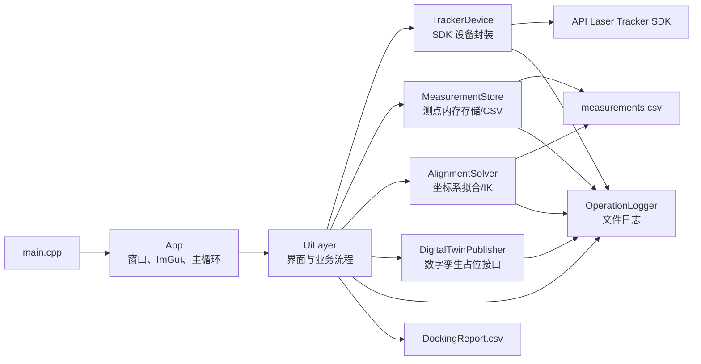
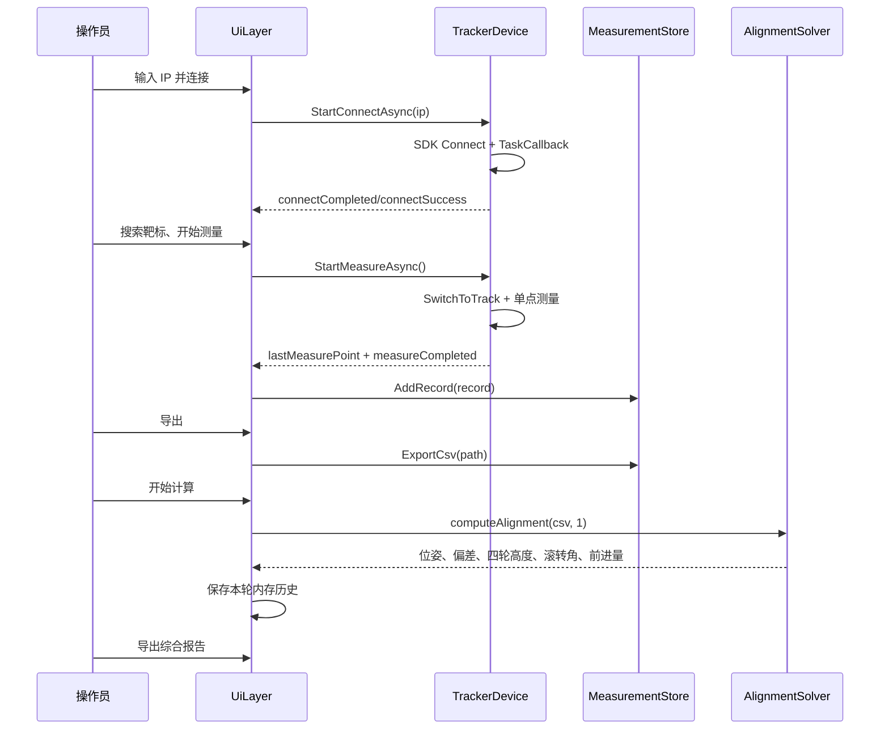

# CPS_API 项目代码说明

> 项目主体：`G:\CPS_API\SenpecKinematicsPoseTracker`  
> 代码审阅范围：自研 C++ 源码、Visual Studio 工程配置、激光跟踪仪 SDK 接口、示例输入/输出文件  
> 整理日期：2026-07-03  
> 说明基准：当前工作区中的实际代码；未把 `vcpkg_installed`、Eigen、Dear ImGui 和 SDK 内部实现当作自研代码展开

## 1. 项目概述

该项目是一套面向压力容器/筒体对接作业的 Windows 桌面软件。程序通过 API Laser Tracker SDK 连接 Radian Pro 激光跟踪仪，完成靶标搜索、单点测量、测点存储与 CSV 导出；随后根据固定顺序的 18 个空间靶标点拟合世界坐标系、固定段端面坐标系和移动段端面坐标系，计算当前对接偏差以及移动底盘/调姿机构的控制量。

程序还提供：

- 实际硬件模式与模拟模式；
- 激光跟踪仪连接、Home、工作模式切换、点动和螺旋搜索；
- 实时坐标、角度、距离、光强和温度显示；
- 测量记录表、剪贴板复制和 CSV 导出；
- 当前/目标 4×4 位姿矩阵和 6 自由度位姿分量显示；
- 多轮计算历史和综合报告导出；
- 文件日志、界面运行日志、显示主题和内置使用说明。

当前自研代码约 3,500 行，主要复杂度集中在：

1. `src/ui/UiLayer.cpp`：界面、业务流程和状态编排；
2. `src/core/TrackerDevice.cpp`：跟踪仪 SDK 封装；
3. `src/core/AlignmentSolver.cpp`：坐标系拟合、偏差评估和逆运动学计算。

## 2. 项目边界与目录结构

`G:\CPS_API` 下有三个主要目录：

```text
G:\CPS_API
├─ SenpecKinematicsPoseTracker
│  ├─ include                 # 自研头文件与 stb_image 单头文件
│  │  ├─ App.h
│  │  ├─ core
│  │  │  ├─ AlignmentSolver.h
│  │  │  ├─ DigitalTwinPublisher.h
│  │  │  ├─ MeasurementStore.h
│  │  │  ├─ OperationLogger.h
│  │  │  └─ TrackerDevice.h
│  │  └─ ui
│  │     └─ UiLayer.h
│  ├─ src                     # 自研实现
│  │  ├─ main.cpp
│  │  ├─ App.cpp
│  │  ├─ core
│  │  │  ├─ AlignmentSolver.cpp
│  │  │  ├─ DigitalTwinPublisher.cpp
│  │  │  ├─ MeasurementStore.cpp
│  │  │  ├─ OperationLogger.cpp
│  │  │  └─ TrackerDevice.cpp
│  │  └─ ui
│  │     └─ UiLayer.cpp
│  ├─ resources               # Logo、操作说明图片及图片转头文件脚本
│  ├─ thirdparty\Eigen        # Eigen 矩阵库的本地副本
│  ├─ vcpkg_installed         # vcpkg 安装/构建产物，不属于业务源码
│  ├─ out\build               # Debug/Release 编译输出
│  ├─ logs                    # 程序运行日志
│  ├─ config.json             # 默认设备 IP
│  ├─ measurements.csv        # 示例/默认测点文件
│  ├─ DockingReport.csv       # 示例综合报告
│  ├─ vcpkg.json              # spdlog 依赖清单
│  ├─ *.sln / *.vcxproj       # Visual Studio 解决方案与工程
│  └─ 若干 tmp_*、脚本、日志  # 开发期辅助文件或运行产物
├─ API_LaserTrackerSDK_v7.18.0.0_Windows_MFC_cpp
│  ├─ include\api             # 跟踪仪 SDK 公共头文件
│  ├─ lib                     # libltinterface.lib
│  ├─ bin                     # SDK、Qt 运行时 DLL 和工具
│  ├─ sample_code_*           # 厂商示例
│  └─ share\doc               # SDK HTML 文档
└─ imgui-1.92.7
   └─ imgui-1.92.7            # Dear ImGui 源码、后端和 GLFW 预编译库
```

### 2.1 自研代码与外部依赖的划分

| 类别 | 内容 | 是否建议直接修改 |
|---|---|---:|
| 自研业务代码 | `SenpecKinematicsPoseTracker\include`、`src` | 是 |
| 自研资源 | `resources\LogoImage.h`、`LogoImage1.h` | 通过资源转换流程更新 |
| 工程配置 | `.sln`、`.vcxproj`、`vcpkg.json` | 按构建需求修改 |
| 厂商 SDK | `API_LaserTrackerSDK...` | 否，升级时整体替换并做兼容验证 |
| UI 框架 | `imgui-1.92.7` | 通常不直接修改 |
| 数学库 | `thirdparty\Eigen` | 通常不直接修改 |
| 生成物 | `.vs`、`out`、`logs`、`vcpkg_installed`、DLL、PDB | 否，应由构建或运行过程产生 |

## 3. 技术栈与构建环境

| 项目 | 当前配置 |
|---|---|
| 语言 | C++17 |
| IDE/构建系统 | Visual Studio 2022 / MSBuild |
| 工具集 | MSVC v143 |
| 平台 | Windows x64 |
| Windows SDK | `10.0.26100.0` |
| 字符集 | Unicode，编译附加参数 `/utf-8` |
| 图形界面 | Dear ImGui 1.92.7 |
| 窗口与 OpenGL 上下文 | GLFW + OpenGL 3.3 Core |
| 线性代数 | Eigen |
| 日志 | spdlog，由 vcpkg manifest 提供 |
| 图像解码 | stb_image |
| 激光跟踪仪 | API Laser Tracker SDK 7.18.0.0 |
| 目标设备模型 | 代码中固定为 `api::lt::DeviceModel::RadianPro` |

工程提供 `Debug|x64` 和 `Release|x64` 两种配置。输出目录分别为：

```text
out\build\Debug\
out\build\Release\
```

项目使用 Console 子系统，因此启动 GUI 程序时可能同时出现控制台窗口。

## 4. 总体架构

程序采用一个轻量的分层结构。`App` 负责对象生命周期和主循环，`UiLayer` 负责界面及业务编排，多个 `core` 类负责设备、数据、算法和日志。



### 4.1 对象所有权

`App` 以成员变量形式持有所有核心对象：

```cpp
TrackerDevice device_;
MeasurementStore store_;
AlignmentSolver solver_;
DigitalTwinPublisher publisher_;
UiLayer uiLayer_;
```

构造 `UiLayer` 时，把前四个对象以引用注入。`UiLayer` 不拥有这些对象，只调用它们。这样避免了全局设备对象，但当前 UI 层仍承担了大量控制器职责。

### 4.2 主数据流



一个重要设计事实是：**算法不是直接读取 `MeasurementStore`，而是重新读取界面指定的 CSV 文件。** 因此“表格里的数据”“刚导出的文件”和“算法实际读取的文件”必须由操作流程保证一致。

## 5. 启动和退出流程

### 5.1 `src/main.cpp`

入口非常简单：

1. 在栈上创建 `senpec::App`；
2. 调用 `App::Run()`；
3. 把返回值作为进程退出码。

### 5.2 `App::InitWindow`

初始化顺序为：

1. `glfwInit()`；
2. 请求 OpenGL 3.3 Core Profile；
3. 创建 1280×720 窗口，标题为“压力容器对接测量和计算软件”；
4. 设为当前 OpenGL 上下文并启用垂直同步；
5. 创建 ImGui 上下文；
6. 尝试加载 `C:\Windows\Fonts\simhei.ttf` 的完整中文字形，失败则使用默认字体；
7. 读取 ImGui 默认颜色并交给 `UiLayer` 作为“恢复默认”基准；
8. 初始化 GLFW/OpenGL3 的 ImGui 后端；
9. 写入初始化成功日志。

### 5.3 `App::Run`

每一帧执行：

1. 轮询 GLFW 事件；
2. 从 `UiLayer` 读取 UI 缩放和主题配置；
3. 创建 ImGui 新帧；
4. 调用 `UiLayer::Render()`；
5. 清屏并绘制 ImGui；
6. 交换前后缓冲；
7. 根据目标 FPS 主动休眠。

目标帧率最小按 1 FPS 处理。设置窗口中允许 10～240 FPS。

### 5.4 `App::Shutdown`

按 ImGui OpenGL 后端、ImGui GLFW 后端、ImGui 上下文、GLFW 窗口、GLFW 全局状态的顺序清理。`Run()` 结束和 `App` 析构都会调用 `Shutdown()`，但以 `window_ != nullptr` 防止重复释放。

## 6. 核心数据模型

### 6.1 测点和实时状态

`MeasurementPoint` 是设备层的一次笛卡尔测量：

| 字段 | 含义 | 单位 |
|---|---|---|
| `x`、`y`、`z` | 跟踪仪坐标系中的测点 | mm |

`TrackerRealTimeStatus` 是 UI 使用的实时状态快照：

| 字段 | 来源/说明 |
|---|---|
| `azimuth`、`elevation` | SDK `RealTimeInfo.az/el`，单位 ° |
| `x/y/z`、`distance` | SDK 实时位置和距离，单位 mm |
| `intensity` | SDK `diagnostic_info.laser_intensity` |
| `isLaserPathError` | 由 `!is_measurement_valid` 转换 |
| `isWarmingUp` | 由 `!is_warmed_up` 转换 |
| `temperature` | 跟踪仪机体温度，单位 °C |
| `pressure`、`humidity` | 实际模式当前固定为 0，尚未读取气象站接口 |
| `operationMode` | SDK 当前云台工作模式 |

### 6.2 测量记录

`MeasurementRecord` 包含：

- 顺序号 `index`；
- 测点 `x/y/z`；
- 靶标球规格字符串；
- 时间戳；
- 一个 `KinematicsResult` 字段。

当前代码在采集测点时只填充前五类数据，`kinematics` 字段尚未使用。运动学结果实际保存于 UI 层的 `SimulatedKinematicsResult`。

### 6.3 运动学显示结果

`SimulatedKinematicsResult` 虽然名称带有 “Simulated”，但实际模式和模拟模式的算法结果都使用它。内容包括：

- 四个轮/支链高度；
- 整体滚转角；
- 前进距离；
- 当前位姿和目标位姿的 4×4 矩阵；
- 当前位姿和目标位姿的 `[X,Y,Z,Rx,Ry,Rz]`；
- 轴线夹角、端面间距和错边量。

### 6.4 多轮记录

`RoundRecord` 保存：

- 轮次编号；
- 计算完成时间；
- 该轮新增的内存测点；
- 本轮运动学结果。

`historyRounds_` 只存在于进程内存，关闭程序后不会恢复。

## 7. `TrackerDevice`：激光跟踪仪 SDK 封装

### 7.1 职责

`TrackerDevice` 把厂商接口封装成 UI 可以调用的方法，并用原子状态量向 UI 报告后台任务进度。

主要接口如下：

| 方法 | 行为 |
|---|---|
| `StartAutoDetect()` | 当前只提示 SDK 不支持自动搜索，不会真正发现 IP |
| `StartConnectAsync(ip)` | 提交 SDK 异步连接 |
| `StartDisconnectAsync()` | 后台执行 `AbortProcedure` 和阻塞式 `Disconnect` |
| `StartMeasureAsync()` | 后台执行 1000 ms 单点平均测量 |
| `StartSearchTargetAsync()` | 切到 Track 后提交 30 s 螺旋搜索 |
| `SwitchToIdle/Position/Track()` | 切换云台工作模式 |
| `EnableCameraSearch(bool)` | 开关相机搜索 |
| `Home(SmrSize)` | 根据靶标球规格执行 Home |
| `MoveAzimuth/MoveElevation()` | 用 `JogTo` 朝预设极限目标移动 |
| `StopMotionByModeChange()` | Idle 后切回 Position，以模式切换停止 |
| `StopMotion()` | 调用 `AbortProcedure()` 急停/打断过程 |
| `GetRealTimeStatus()` | 读取 SDK `RealTimeInfo` 并转换成 UI 快照 |

### 7.2 连接流程

连接调用为：

```cpp
apiDevice_.Connect(
    api::lt::DeviceModel::RadianPro,
    ipAddress.c_str(),
    nullptr,                         // camera_ip_address
    &TrackerDevice::TaskCallback,
    this,
    nullptr,                         // prm_files_path
    dllDirectory.c_str());
```

特点：

- 设备型号固定为 Radian Pro；
- 相机 IP 和 PRM 路径传空；
- DLL 目录使用当前 EXE 所在目录；
- `Connect` 成功仅表示任务提交成功；
- 最终成功/失败由 SDK 的 `TaskCallback` 返回；
- 回调遇到 `TaskMode::Connect` 时更新连接状态；
- 回调遇到 `TaskMode::SpiralSearch` 时结束搜索状态。

### 7.3 断开流程

`Disconnect()` 在 SDK 中是阻塞调用，因此项目用分离线程执行：

1. 先 `AbortProcedure()`；
2. 再 `Disconnect()`；
3. 清理连接、搜索和任务状态；
4. 设置 `disconnectCompleted_` 通知 UI。

### 7.4 单点测量流程

1. 检查未在测量且设备已连接；
2. 后台线程尝试切到 Track；
3. 调用：

   ```cpp
   GetSinglePointMeasurement(1000, measuredPoint, rmsError);
   ```

4. 成功后保存 `x/y/z` 和 RMS；
5. `lastMeasureAvg_` 当前保存的是平均时间 `1000`，不是平均误差；
6. `lastMeasureMax_` 当前固定为 `0.0`；
7. 设置 `measureCompleted_`，由 UI 下一帧消费。

### 7.5 靶标搜索和运动控制

螺旋搜索参数为：

```cpp
SpiralSearch(0.0f, 0.0f, 30000);
```

即估计距离和半径均传 0，超时 30 秒。

方位角和俯仰角的“点动”函数并没有使用传入角度的大小，只使用正负号选择绝对目标：

| 方向 | `JogTo` 目标 |
|---|---:|
| 方位角正向 | +320° |
| 方位角反向 | -320° |
| 俯仰角正向 | +243° |
| 俯仰角反向 | -63° |

按下按钮时向远端目标运动，松开时通过 Idle → Position 停止。因此它更接近“按住向限位方向运动”，而不是按固定步长微调。

### 7.6 SDK 错误处理

`DescribeApiError` 把 SDK 的主要 `ErrorType` 枚举映射为英文名称，日志同时写入数值错误码和枚举名，例如：

```text
GetSinglePointMeasurement 失败: 错误码 20 (MeasurementNotValid)
```

这对现场诊断很有价值。UI 层只显示概括信息，详细错误应从 `logs\senpec_*.log` 查看。

## 8. `MeasurementStore`：测点存储与导出

### 8.1 内存行为

`MeasurementStore` 内部是：

```cpp
std::vector<MeasurementRecord> records_;
```

- `AddRecord` 追加，不自动去重；
- `Clear` 清空全部记录；
- `GetRecords` 返回常量引用；
- 没有持久化恢复、容量限制或线程锁。

当前所有增删操作由 UI 线程发起，后台测量完成后也是由 UI 消费数据并调用 `AddRecord`。

### 8.2 测点 CSV

导出格式固定为：

```csv
Index,X,Y,Z,TargetSize,Timestamp
1,0.000,6790.000,0.000,1.5,2026-05-13 19:17:13
```

字段说明：

| 列 | 含义 |
|---|---|
| `Index` | 采集顺序，同时也是算法点位顺序 |
| `X/Y/Z` | 空间坐标，单位 mm |
| `TargetSize` | `1.5`、`0.5` 或 `7/8` |
| `Timestamp` | 本地时间，格式 `%Y-%m-%d %H:%M:%S` |

导出前通过 `std::filesystem::u8path` 处理 UTF-8 路径，能够支持中文路径。文件采用覆盖写入。

## 9. `AlignmentSolver`：对接与调姿算法

### 9.1 输入契约

算法读取 CSV 时：

1. 无条件跳过第一行；
2. 按英文逗号拆列；
3. 使用第 2、3、4 列作为 X、Y、Z；
4. 至少需要 18 个有效数据行；
5. 超过 18 个点时，后续点会被读取，但当前计算只使用前 18 个；
6. 点的**顺序具有严格语义**，不是任意 18 点。

18 个点的当前使用方式如下：

| CSV 序号 | 零基索引 | 算法用途 |
|---:|---:|---|
| 1～3 | 0～2 | 拟合世界/机器基准坐标系 |
| 4～6 | 3～5 | 当前算法未使用，属于预留或冗余点 |
| 7～9 | 6～8 | 固定段第一圆截面的 3 点 |
| 10～12 | 9～11 | 固定段第二圆截面的 3 点 |
| 13～15 | 12～14 | 移动段第一圆截面的 3 点 |
| 16～18 | 15～17 | 移动段第二圆截面的 3 点 |

因此，单纯满足“18 行”并不够；采集顺序必须与现场靶标布局一致。

### 9.2 几何常量

构造函数中固化了机构和工件参数：

| 参数 | 数值 | 代码中的可能含义 |
|---|---:|---|
| `Rw` | 1753.0 mm | 筒体半径，来自 `3506 / 2` |
| `Lw` | 9580.0 mm | 工件/筒体长度 |
| `L_fixed` | 4000.0 mm | 固定段长度，当前未参与后续计算 |
| `Xc` | 1355.0 mm | 支撑点横向半间距，来自 `2710 / 2` |
| `Yc` | 2250.0 mm | 支撑点纵向半间距，来自 `4500 / 2` |
| `Hc` | 1500.0 mm | 机构名义高度 |
| `rr` | 425.0 mm | 轮/滚轮半径，来自 `850 / 2` |
| `Lr` | 350.0 mm | 当前未参与后续计算 |
| `Zw` | 计算值 | 构造时计算，但当前未参与后续计算 |

理想世界变换 `T_W_ideal` 为单位矩阵加 Y 向平移：

```text
Y = Lw / 2 = 4790 mm
```

### 9.3 变换约定

算法使用 4×4 齐次变换矩阵：

```text
T = [ R  p ]
    [ 0  1 ]
```

- `R` 的三列分别是局部 X、Y、Z 轴在父坐标系中的方向；
- `p` 是局部坐标系原点；
- 代码按列向量约定组合变换；
- 位姿分量采用 `[X, Y, Z, Rx, Ry, Rz]`；
- 平移单位为 mm，旋转显示单位为 °；
- 欧拉角提取对应 `R = Rx * Ry * Rz` 的约定。

### 9.4 三点圆心计算

`fitCircle3D(p1,p2,p3)` 根据同一空间平面内的三个点计算圆心。它用于从两个圆截面各取三个靶标点，得到两个截面圆心，再由两个圆心确定筒体轴线。

该函数默认：

- 三个点不共线；
- 点间距离足够大；
- 输入没有 NaN/Inf。

当前没有退化检测；三点共线或近似共线时，分母 `n.squaredNorm()` 可能为 0 或很小。

### 9.5 解算步骤

#### 步骤 1：拟合测量世界坐标系

取前三点 `p1,p2,p3`：

```text
原点 O_W = p2
Y_W = normalize(p1 - p2)
Z_W = normalize((p3 - p2) × (p1 - p2))
X_W = normalize(Y_W × Z_W)
```

由此构造 `T_W_fitted`。

#### 步骤 2：拟合固定段端面坐标系

固定段的两组圆点为：

```text
C1_F = circle(targets[6], targets[7], targets[8])
C2_F = circle(targets[9], targets[10], targets[11])
```

固定段 Y 轴：

```text
Y_F = normalize(C2_F - C1_F)
```

端面原点从第一圆心沿轴线反向偏移 500 mm：

```text
O_F = C1_F - 500 * Y_F
```

再用第二圆中的一个点确定横向 X 轴，并把该方向正交投影到垂直于 Y 轴的平面，最后令：

```text
Z_F = X_F × Y_F
```

#### 步骤 3：拟合移动段端面坐标系

移动段类似，但轴方向相反：

```text
C1_M = circle(targets[12..14])
C2_M = circle(targets[15..17])
Y_M = normalize(C1_M - C2_M)
O_M = C1_M + 500 * Y_M
Z_M = X_M × Y_M
```

得到测量坐标系中的移动段当前端面 `T_M0_fitted`。

#### 步骤 4：映射到机器理想坐标系

```text
T_LT2Machine = T_W_ideal * inverse(T_W_fitted)
T_M0        = T_LT2Machine * T_M0_fitted
T_F_curr    = T_LT2Machine * T_F_fitted
```

这一步把跟踪仪测得的坐标统一转换到机器理想坐标系。

#### 步骤 5：选择目标匹配策略

解算器实现了三种模式：

| 模式 | 目标位姿 |
|---:|---|
| 1 | `T_Mnew = T_F_curr`，移动段与固定段端面完全重合 |
| 2 | 使用固定段姿态，但保留移动段当前位置，只做姿态平行 |
| 3 | 在移动段当前位姿后叠加人工 6 自由度增量 |

当前 UI 的 `StartKinematicsSolve()` 固定传入模式 1，因此模式 2、模式 3 尚未从界面开放。

模式 3 的人工变换顺序为：

```text
T_manual = Trans(dx,dy,dz) * RotX(rx) * RotY(ry) * RotZ(rz)
T_Mnew   = T_M0 * T_manual
```

#### 步骤 6：计算运动控制量

四个支撑点的横纵坐标为：

```text
X = [+Xc, +Xc, -Xc, -Xc]
Y = [+Yc, -Yc, +Yc, -Yc]
```

整体前进量：

```text
dy_cmd = T_Mnew.y - T_M0.y
```

目标支撑纵坐标随整体前进量平移：

```text
Y_new[i] = Y[i] + dy_cmd
```

相对变换：

```text
Delta_T_M = inverse(T_M0) * T_Mnew
roll_cmd_fixed = -degrees(asin(Delta_T_M[0,2]))
```

对每个支链，在目标筒体轴线上求与该支撑纵坐标对应的轴心位置：

```text
t_i      = (Y_new[i] - P_a.y) / v_a.y
X_axis_i = P_a.x + t_i * v_a.x
Z_axis_i = P_a.z + t_i * v_a.z
```

再根据筒体与滚轮几何关系计算高度：

```text
inner = (Rw + rr)^2 - (X_support[i] - X_axis_i)^2
H_i   = Z_axis_i - sqrt(inner)
```

若 `inner < 0`，认为动作幅度超限、存在脱轨风险，整次解算失败。

输出控制量为：

- `H_cols_cmd[0..3]`：四个轮/支链的目标高度；
- `roll_cmd_fixed`：滚转控制量；
- `dy_cmd`：整体前进量。

从公式看，`H_cols_cmd` 更接近**绝对几何高度**，不是相对当前高度的增量；接入执行机构前应再次确认控制系统需要绝对量还是增量。

#### 步骤 7：对接质量评估

移动段和固定段的轴线都取各自坐标系的 Y 轴。

轴线夹角：

```text
axis_angle_dev = degrees(acos(clamp(Y_M0 · Y_F, -1, 1)))
```

设两端面中心差：

```text
dP = center_F - center_M0
```

端面间距是沿固定段轴线的分量绝对值：

```text
end_face_spacing = abs(dP · Y_F)
```

错边量是垂直于固定段轴线的分量模长：

```text
misalignment = norm(dP - (dP · Y_F) * Y_F)
```

当前只计算数值，没有在代码中设置工艺公差，也不会自动给出“合格/不合格”结论。

#### 步骤 8：输出位姿

为了向 UI 展示相对理想基准的位姿：

```text
mat_M0   = inverse(T_W_ideal) * T_M0
mat_F    = inverse(T_W_ideal) * T_F_curr
mat_Mnew = inverse(T_W_ideal) * T_Mnew
```

随后提取：

```text
[X, Y, Z, Rx, Ry, Rz]
```

并将矩阵、向量、偏差和控制量保存在 `AlignmentSolver` 的公开成员中，供 UI 直接复制。

### 9.6 解算失败条件

当前明确处理的失败包括：

- CSV 文件打不开；
- 某一行 X/Y/Z 无法转换为数字；
- 有效点少于 18；
- 对接模式不是 1、2、3；
- 某支链几何根号项小于 0。

未明确处理但可能产生 NaN/Inf 的情况包括：

- 拟合圆的三点共线或近似共线；
- 定义坐标轴的点重合；
- 目标轴线 `v_a.y` 接近 0；
- 欧拉角提取接近奇异位姿；
- 输入数值本身为 NaN/Inf。

## 10. `UiLayer`：界面和流程编排

### 10.1 界面布局

主工作区分成三个可拖动区域：

```text
┌────────────────────────────┬──────────────────────┐
│ 跟踪仪操作和测量           │ 偏差和运动学计算     │
│ - 连接                     │ - CSV 导入           │
│ - 靶标规格                 │ - 对接质量           │
│ - 实时状态/运动/测量       │ - 当前/目标位姿      │
│ - 测量结果表               │ - 控制量/多轮报告    │
├────────────────────────────┴──────────────────────┤
│ 日志打印                                          │
└───────────────────────────────────────────────────┘
```

左右比例和上下比例在运行期内保存为成员变量，但没有写回配置文件。

### 10.2 菜单

菜单提供：

- 打开测量结果、导入 CSV、综合报告；
- 显示设置；
- 实际模式/模拟模式切换；
- 打开当前日志文件；
- 关于窗口；
- 软件使用说明窗口。

外部打开文件使用 Windows `ShellExecuteW`，并先检查文件是否存在。

### 10.3 实际模式与模拟模式

模拟模式不会调用 SDK：

- 自动搜索会随机生成 `192.168.0.100～254`；
- 连接/断开只切换内存布尔值；
- 实时坐标和距离带有小幅随机变化；
- 方位角、俯仰角在按住按钮时每帧加减 0.2；
- 单点坐标在 `[-2000, 2000]` 内随机生成。

模拟模式适合验证 UI 和数据流程，但随机生成的 18 点通常不满足实际几何关系，直接进入对接解算可能出现无意义结果或失败。要测试算法，应使用结构正确的示例 CSV。

### 10.4 连接与 Home

UI 默认从运行目录的 `config.json` 读取：

```json
{
  "ip": "192.168.0.168"
}
```

如果文件不存在，会创建默认 IP `192.168.0.10`。解析方式是字符串查找，不是完整 JSON 解析器。

靶标球规格与 SDK `SmrSize` 映射：

| UI | SDK 枚举 |
|---|---|
| 1.5 英寸 | `OneHalfInch` |
| 0.5 英寸 | `HalfInch` |
| 7/8 英寸 | `SevenEighthInch` |

SDK 的 `OneHalfInch` 命名容易误读，但其头文件注释明确表示 1.5 英寸。

### 10.5 实时状态

实际模式下每 500 ms 调用一次 `GetRealTimeStatus()`；模拟模式下每 100 ms 更新一次。

UI 展示：

- 光路是否有效；
- 光强进度条；
- X/Y/Z、距离；
- 方位角、俯仰角；
- 温度、气压；
- SDK 工作模式。

实际模式的气压和湿度尚未接 SDK，当前显示 0。SDK 注释表明 `laser_intensity` 的单位是伏特，而 UI 直接将其裁剪到 `[0,1]` 作为进度条，量程是否正确需要结合设备实际输出确认。

### 10.6 测量处理

后台测量完成后，`Render()` 检查 `device_.measureCompleted_`。成功则调用 `HandleMeasurement()`：

1. 从设备缓存或模拟器取得测点；
2. 根据下拉框生成靶标规格；
3. 用当前表格大小 + 1 生成序号；
4. 写入当前时间；
5. `store_.AddRecord(record)`；
6. `publisher_.Publish(record)`；
7. 追加界面日志。

### 10.7 运动学计算和多轮历史

`StartKinematicsSolve()`：

1. 从内存测量表中截取“上次成功计算后新增的点”；
2. 检查导入 CSV 是否存在；
3. 固定用模式 1 调用 `solver_.computeAlignment`；
4. 把解算器公开结果复制到 UI 结果结构；
5. 创建 `RoundRecord`；
6. 记录当前内存测点总数；
7. 轮次号加一。

这里有两套数据源：

- 本轮报告中的测点来自 `MeasurementStore`；
- 本轮算法输入来自 `kinematicsCsvPath_` 指向的文件。

代码没有校验二者是否相同。

### 10.8 综合报告

报告使用 UTF-8 BOM，便于 Excel 正确显示中文。每轮包含：

1. 靶标球空间测量数据；
2. 轴线夹角、端面间距、错边量；
3. 四轮高度、滚转角、前进距离；
4. 当前/目标位姿分量和 4×4 矩阵。

报告文件虽使用 `.csv` 扩展名，但内容包含多段标题、分隔线和多个不同宽度的表格，更准确地说是“面向 Excel 打开的结构化文本报告”，不是单一规则表格。

### 10.9 UI 主要函数索引

| 函数 | 作用 |
|---|---|
| `Render()` | 每帧总入口，同时消费后台测量完成事件 |
| `RenderMainMenu()` | 打开、设置、日志和帮助菜单 |
| `RenderMainWorkspace()` | 创建左上、右上、底部三个可分割主区域 |
| `RenderConnectionPanel()` | IP、搜索、连接、断开和 Home |
| `RenderTargetPanel()` | SMR 规格选择 |
| `RenderControlPanel()` | 实时状态、模式切换、运动、搜索和测量 |
| `RenderTablePanel()` | 测点表、导出、清空和复制 |
| `RenderKinematicsWindow()` | CSV 导入、算法结果、多轮历史和报告 |
| `RenderMatrix4x4()` | 显示并复制位姿矩阵 |
| `RenderPoseVector()` | 显示并复制 6 自由度位姿 |
| `RenderRuntimeLogWindow()` | 界面日志显示、清空和复制 |
| `RenderDisplaySettingsWindow()` | 缩放、FPS 和颜色设置 |
| `RenderAboutWindow()` | Logo、版本和编译时间 |
| `RenderUserManualWindow()` | 内嵌操作说明图和五步操作指南 |
| `HandleMeasurement()` | 将设备/模拟测点转换为 `MeasurementRecord` |
| `StartKinematicsSolve()` | 调用解算器并固化一轮结果 |
| `ExportDockingReport()` | 把 `historyRounds_` 写成综合报告 |
| `OpenSystemFile()` | 通过系统默认程序打开结果文件 |

## 11. 日志系统

`OperationLogger` 是进程内单例，首次使用时：

1. 在当前工作目录创建 `logs`；
2. 生成 `senpec_YYYYMMDD_HHMMSS.log`；
3. 新文件写入 UTF-8 BOM；
4. 创建 spdlog 文件 logger；
5. 使用格式：

   ```text
   [2026-07-03 10:00:00] [info] 消息
   ```

6. 每条消息立即 flush。

日志调用由互斥锁保护。界面运行日志 `runtimeLog_` 与文件日志是两套系统：部分消息同时写两边，部分详细 SDK 错误只写文件日志。

## 12. 数字孪生接口现状

`DigitalTwinPublisher::Publish` 当前只是占位：

```cpp
void DigitalTwinPublisher::Publish(const MeasurementRecord&)
{
    OperationLogger::Instance().Log(LogLevel::Debug, "数字孪生数据已发送。");
}
```

它没有：

- 序列化数据；
- 网络连接；
- 消息队列或协议；
- 重试；
- 发送状态；
- 配置项。

因此当前项目没有真正向外部数字孪生系统发布数据。该类的存在为后续 MQTT、OPC UA、HTTP、WebSocket 或现场总线适配预留了入口。

## 13. 配置、输入和运行产物

### 13.1 相对路径基准

下列路径相对于**进程当前工作目录**，不一定是 EXE 目录：

- `config.json`；
- `measurements.csv`；
- `DockingReport.csv`；
- `logs\`；
- `imgui.ini`。

只有 SDK 连接时的 DLL 目录明确取 EXE 所在目录。若从不同工作目录启动程序，配置、日志和默认 CSV 可能落到不同位置。

### 13.2 默认文件

| 文件 | 作用 |
|---|---|
| `config.json` | 默认设备 IP |
| `measurements.csv` | 默认测点导出和算法导入路径 |
| `DockingReport.csv` | 默认综合报告路径 |
| `imgui.ini` | ImGui 窗口状态 |
| `logs\senpec_*.log` | 应用操作与错误日志 |
| `LaserTrackerLogging.log` | SDK 自身日志，非 `OperationLogger` 生成 |

## 14. 构建与运行

### 14.1 前置条件

建议准备：

- Visual Studio 2022；
- “使用 C++ 的桌面开发”工作负载；
- MSVC v143；
- Windows 10/11 SDK，当前工程指定 `10.0.26100.0`；
- 可用的 vcpkg 集成；
- 目录保持当前相对关系：

  ```text
  G:\CPS_API\
  ├─ SenpecKinematicsPoseTracker\
  ├─ API_LaserTrackerSDK_v7.18.0.0_Windows_MFC_cpp\
  └─ imgui-1.92.7\imgui-1.92.7\
  ```

### 14.2 编译

1. 打开：

   ```text
   G:\CPS_API\SenpecKinematicsPoseTracker\SenpecKinematicsPoseTracker.sln
   ```

2. 选择 `x64`；
3. 选择 `Debug` 或 `Release`；
4. 生成解决方案；
5. vcpkg 根据 `vcpkg.json` 提供 `spdlog`。

### 14.3 链接依赖

工程显式链接：

```text
libltinterface.lib
glfw3.lib
opengl32.lib
user32.lib
gdi32.lib
shell32.lib
winmm.lib
imm32.lib
ole32.lib
oleaut32.lib
uuid.lib
```

### 14.4 运行时 DLL

Debug 输出目录中当前可见的主要运行时包括：

```text
libltinterface.dll
libltbackend.dll
libltgui.dll
Qt6Core.dll
Qt6Gui.dll
Qt6Widgets.dll
Qt6OpenGL.dll
Qt6OpenGLWidgets.dll
fmtd.dll
*.prm
```

工程文件本身没有配置稳定的 Post-Build 复制步骤。也就是说，在全新机器或清理输出目录后，只完成链接并不保证可运行；还需要把与 SDK 版本、构建配置匹配的 DLL/PRM 文件部署到 EXE 目录。当前 Debug 和 Release 输出目录中的 DLL 集合并不一致，正式发布前应整理统一的部署清单。

## 15. 当前实现中的关键限制与风险

以下不是抽象的代码风格建议，而是从当前执行路径直接观察到的问题。

### 15.1 高优先级：多轮计算可能重复使用第一轮 18 点

`parseTargetsCSV` 会读入所有点，但算法固定使用 `targets[0]～targets[17]`。如果第二轮测点追加在同一个 `MeasurementStore` 后再整体导出，CSV 将有 36 点，而第二次计算仍使用前 18 点。

同时，UI 会把新增的后 18 点记为“第 2 轮测点”，造成报告中的测点与实际解算输入不一致。

当前安全操作方式是：**每轮计算完成后清空测量表，重新采集恰好 18 点，覆盖导出 CSV，再开始下一轮计算。**

更可靠的代码修复方向：

- 算法显式接收当前轮的 18 点，而不是读全局 CSV；
- 或 CSV 中加入 `RoundId` 和 `PointRole`；
- 或读取最后 18 点并校验点位角色；
- 报告保存算法实际消费的输入副本。

### 15.2 高优先级：后台分离线程缺少统一生命周期管理

连接回调、断开、测量和搜索都可能在后台运行，其中断开、测量、搜索使用 `detach()`。程序关闭时没有等待这些线程，也没有在 `TrackerDevice` 析构中统一取消任务。

潜在后果：

- 后台线程在 `TrackerDevice` 已析构后继续访问 `this`；
- SDK 对象关闭期间仍被线程调用；
- 程序退出偶发崩溃或卡住；
- 设备未完成安全断开。

建议把任务线程改为可 join 的成员线程或 `std::jthread`，析构时先取消、断开、再等待。

### 15.3 高优先级：算法输入缺少退化和有限值校验

三点圆拟合、单位化、轴线求交和欧拉角提取都可能在退化几何下产生 NaN/Inf。当前只有根号负数会给出清晰错误。

建议增加：

- 每组三点的最小三角形面积；
- 点间最小距离；
- 两截面圆心最小间距；
- `abs(v_a.y)` 下限；
- 所有中间矩阵和输出的 `isFinite()`；
- 欧拉角 `asin` 输入裁剪；
- 旋转矩阵正交性和行列式检查。

### 15.4 数据源一致性未校验

界面表格、导出路径、导入路径彼此独立。用户可以：

- 采集了新点但没有重新导出；
- 导出到 A 文件、算法读取 B 文件；
- 算法读取旧文件，但报告保存新测点；
- 直接编辑 CSV，报告却仍使用内存测点。

建议把“计算当前轮”改成以当前轮内存快照为唯一输入，同时把快照导出作为审计副本。

### 15.5 自动搜索 IP 是占位功能

实际模式的 `StartAutoDetect()` 不调用 SDK，只写“SDK 未提供自动搜索接口”。界面的“自动搜索”按钮在实际模式下不会获取 IP。使用说明中“点击自动搜索获取设备 IP”的描述与当前实现不一致。

### 15.6 数字孪生发布是占位功能

`DigitalTwinPublisher` 没有实际发布。界面日志中的“已发布到数字孪生”只能理解为调用了占位函数，不能作为外部系统已收到数据的证据。

### 15.7 UI 类职责过重

`UiLayer.cpp` 同时负责：

- ImGui 绘制；
- 设备状态轮询；
- 业务流程；
- 模拟器；
- 文件打开；
- 配置解析；
- 测量记录组装；
- 多轮状态；
- 报告生成；
- OpenGL 纹理管理。

这使得单元测试困难，也容易在修改界面时影响业务状态。建议逐步拆为：

```text
UiLayer
├─ MeasurementController
├─ DockingWorkflowService
├─ ReportExporter
├─ SimulationTracker
├─ AppConfig
└─ TextureResource
```

### 15.8 设备数据语义有待确认

- UI 把 SDK 激光强度电压直接裁剪为 0～1；
- 实际模式气压、湿度固定为 0；
- `lastMeasureAvg_` 保存 1000 ms，却以 `avg` 名称显示；
- `lastMeasureMax_` 始终为 0；
- 四轮高度是绝对值还是执行增量尚未通过接口类型明确；
- `MoveAzimuth/MoveElevation` 的参数名叫 `stepDegrees`，实际只使用正负号。

这些字段在接入现场控制系统前应逐一确认单位和语义。

### 15.9 构建和部署可复现性不足

- Eigen 和 ImGui 以本地相对目录接入；
- GLFW 使用 ImGui 示例目录内名为 `lib-vc2010-64` 的预编译库；
- SDK DLL/PRM 没有正式的构建后复制规则；
- 工程目录中存在未纳入版本控制的第三方目录和大量生成物；
- Debug/Release 输出的 DLL 集合不一致。

建议建立固定的依赖版本、发布脚本和干净机器验证流程。

### 15.10 其他可维护性问题

- `RenderSplitterWindows()` 当前没有被调用；
- `detectThread_`、`detectMutex_` 等旧的 IP 搜索状态基本未使用；
- `L_fixed`、`Lr`、`Zw` 当前计算后未参与解算；
- `realTimeConnected_` 被写入但 `IsConnected()` 实际直接查询 SDK；
- `KinematicsResult` 和 `MeasurementRecord::kinematics` 未进入主流程；
- 运动学结果通过公开成员变量共享，缺少不可变结果对象；
- 配置解析依赖字符串查找，不支持通用 JSON 语法；
- `WideToUtf8` 为 `required - 1` 个字符分配字符串，却把 `required` 作为输出缓冲长度传给 Win32 API，存在写入结尾空字符时越界一字节的风险；
- 使用 `imgui_internal.h` 和内部 `SplitterBehavior`，升级 ImGui 时需要额外兼容测试。

## 16. 推荐的现场操作流程

在不修改当前代码的前提下，建议按以下流程降低数据错配风险：

1. 从 EXE 所在目录启动程序，确认 `config.json`、SDK DLL 和 PRM 文件齐全；
2. 输入设备 IP 并连接；
3. 选择正确的 SMR 规格并执行 Home；
4. 切到 Track，搜索并锁定靶标；
5. 严格按规定顺序采集当前轮 18 点；
6. 检查表格序号为 1～18；
7. 导出到 `measurements.csv`；
8. 确认右侧导入路径指向刚导出的同一文件；
9. 点击“开始计算”；
10. 保存/检查本轮结果；
11. 开始下一轮前点击“清空”，再重新采集 18 点；
12. 所有轮次完成后，在本次程序未退出前导出综合报告；
13. 保存应用日志和 SDK 日志，作为问题追溯依据。

## 17. 推荐的后续重构顺序

### 第一阶段：保证计算正确性

1. 定义 `TargetRole`，让 18 点带有明确角色；
2. 让解算器直接接收 `std::array<TargetPoint,18>`；
3. 为每轮创建不可变输入快照；
4. 增加退化几何和有限值校验；
5. 增加公差配置和合格判定；
6. 明确控制输出是绝对量还是增量。

### 第二阶段：保证设备线程安全

1. 用受控工作线程替代 `detach()`；
2. 为设备建立明确状态机；
3. 程序退出前取消任务、停止运动、断开并 join；
4. 明确 SDK 是否允许实时读取与测量/搜索并发；
5. 将所有跨线程结果放入一次性结果对象或线程安全队列。

### 第三阶段：拆分 UI 与业务

1. 抽出 `DockingWorkflowService`；
2. 抽出 `CsvMeasurementRepository` 和 `DockingReportExporter`；
3. 抽出真正实现 `ITrackerDevice` 的硬件类和模拟类；
4. 将 `AlignmentResult` 作为返回值，而不是公开成员；
5. 使用正式 JSON 库管理配置。

### 第四阶段：完善部署与集成

1. 建立 Post-Build/安装脚本；
2. 固定 SDK、ImGui、Eigen、GLFW、spdlog 版本；
3. 清理版本库中的构建产物和临时文件；
4. 实现数字孪生传输协议、确认机制和离线重试；
5. 增加自动化测试和发布验收清单。

## 18. 建议测试清单

### 18.1 算法单元测试

- 使用当前示例 `measurements.csv` 验证基准输出；
- 对所有点施加同一刚体变换，验证相对解算不变性；
- 固定段和移动段完全重合；
- 仅存在轴向间距；
- 仅存在横向错边；
- 仅存在小角度偏转；
- 三点共线、重复点、近共线点；
- 少于 18 点、超过 18 点、列缺失、非数字、NaN/Inf；
- `v_a.y` 接近 0；
- 四个支链中任一根号项小于 0；
- 欧拉角接近 ±90°。

### 18.2 设备集成测试

- 正确 IP、错误 IP、网络中断；
- 重复连接和重复断开；
- 测量过程中断开；
- 搜索过程中急停；
- Home 时没有 SMR；
- 设备未预热；
- 光路遮挡、低强度、测量无效；
- 程序在任务进行中退出；
- SDK DLL/PRM 缺失或版本不匹配。

### 18.3 数据流程测试

- 中文目录导出和打开；
- 文件被 Excel 占用；
- 每轮清空后的多轮报告；
- 不清空并累计 36 点时的防错；
- 导出路径与导入路径不一致；
- 程序重启后的历史行为；
- Excel 打开测点 CSV 和综合报告的编码/列格式。

## 19. 文件级职责速查

| 文件 | 主要职责 |
|---|---|
| `src/main.cpp` | 进程入口 |
| `include/App.h` / `src/App.cpp` | 核心对象所有权、GLFW/ImGui 生命周期、渲染主循环 |
| `include/core/TrackerDevice.h` / `src/core/TrackerDevice.cpp` | SDK 连接、测量、搜索、运动、实时状态和错误转换 |
| `include/core/MeasurementStore.h` / `src/core/MeasurementStore.cpp` | 测点内存表和 CSV 导出 |
| `include/core/AlignmentSolver.h` / `src/core/AlignmentSolver.cpp` | 18 点解析、坐标系拟合、目标位姿、偏差和 IK |
| `include/core/OperationLogger.h` / `src/core/OperationLogger.cpp` | spdlog 文件日志单例 |
| `include/core/DigitalTwinPublisher.h` / `src/core/DigitalTwinPublisher.cpp` | 数字孪生发布占位接口 |
| `include/ui/UiLayer.h` / `src/ui/UiLayer.cpp` | 全部界面、实际/模拟模式、流程编排、多轮报告 |
| `resources/LogoImage.h` | 关于窗口内嵌 Logo |
| `resources/LogoImage1.h` | 内置操作说明图片 |
| `include/stb_image.h` | 内嵌图片解码第三方单头文件 |
| `SenpecKinematicsPoseTracker.vcxproj` | 编译、包含目录、链接依赖和输出目录 |
| `vcpkg.json` | spdlog 依赖及 vcpkg baseline |

## 20. 结论

当前项目已经形成完整的“设备操作 → 测点采集 → CSV → 几何解算 → 偏差/控制量 → 多轮报告”演示和现场操作链路，代码的业务意图清晰，SDK 错误日志和中文界面也较完整。

现阶段最需要优先处理的不是界面功能，而是三项工程正确性问题：

1. 让每轮解算输入与该轮报告测点严格绑定，避免 36 点时仍计算前 18 点；
2. 管理后台线程和 SDK 对象生命周期，消除退出和断开时的悬空访问；
3. 为几何拟合和逆运动学补齐退化输入、有限值、量程和公差校验。

完成这三项后，再拆分 UI、补齐数字孪生发布和自动化部署，项目会从“可演示/可操作”稳步进入“可长期现场运行和维护”的状态。
